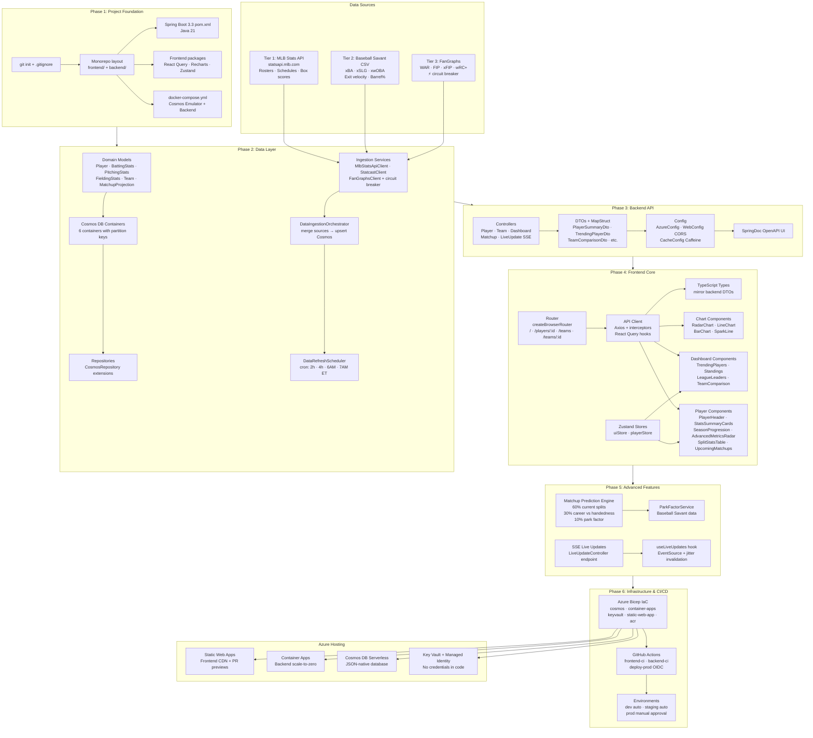
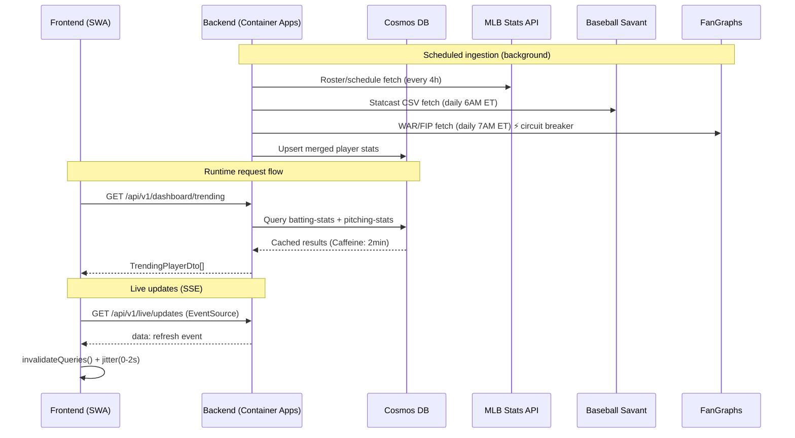

# BuzzBall MLB Stats App — Plan Overview

## Data Flow

## Tech Stack

| Layer | Technology |
|---|---|
| Frontend | React 19 · TypeScript · Vite · Recharts · React Query · Zustand |
| Backend | Java 21 · Spring Boot 3.3 · Spring Data Cosmos · Resilience4j |
| Database | Azure Cosmos DB (NoSQL, serverless dev) |
| Hosting | Azure Static Web Apps + Container Apps |
| Secrets | Azure Key Vault + Managed Identity |
| IaC | Azure Bicep |
| CI/CD | GitHub Actions + OIDC (no stored secrets) |
| Local Dev | Docker Compose (Cosmos emulator + backend) |

